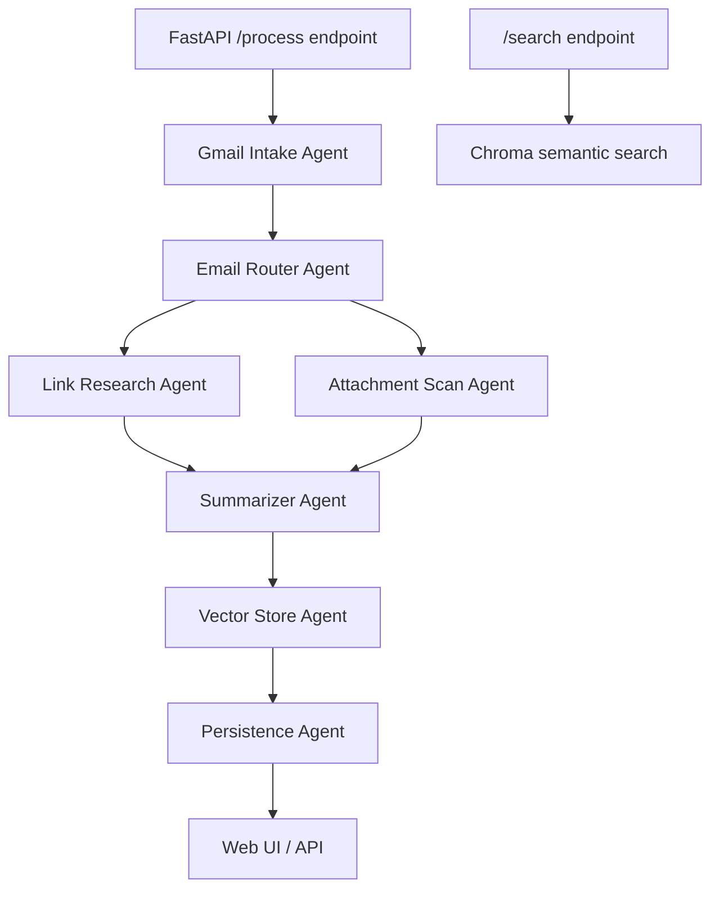

# Email Research Agent

This prototype reads new Gmail messages from a saved cursor, finds links and PDF/Word attachments, extracts their content, summarizes everything, stores the summary in SQLite, and stores searchable semantic chunks in Chroma.

## Architecture



The LangGraph state is the shared envelope passed between agents. Each agent returns only the fields it changed. LangGraph merges those changes into the next state.

## Setup

1. Install Python 3.11 or 3.12.
2. Create the virtual environment and install dependancy

   ```powershell
   py -3.12 -m venv myvenv
   .\myvenv\Scripts\Activate.ps1
   pip install -r requirements.txt
   crawl4ai-setup
   ```

3. Copy `.env.example` to `.env` and fill in your keys.
4. Create a Google Cloud OAuth Desktop app, enable Gmail API, and download it as `credentials.json`.
5. Authorize Gmail:

   ```powershell
   python scripts\authorize_gmail.py
   ```

6. Start the app. On first startup the app creates a cursor set to the current time, so it will not backfill old email unless you explicitly process a date range:

   ```powershell
   uvicorn app.api.main:app --reload
   ```

7. Open `http://127.0.0.1:8000`.

## Important Files

```text
email_research/
  app/
    agents/
      attachment_agent.py
      email_router_agent.py
      gmail_intake_agent.py
      link_agent.py
      nothing_to_process_agent.py
      persistence_agent.py
      summarizer_agent.py
      vector_store_agent.py
    api/main.py
    gmail/client.py
    graph/state.py
    graph/workflow.py
    storage/chroma_store.py
    storage/sqlite_store.py
    static/
      index.html
      styles.css
      app.js
  docs/BEGINNER_GUIDE.md
  scripts/
    authorize_gmail.py
    process_once.py
  requirements.txt
  .env.example
```

- `app/graph/workflow.py` wires the multi-agent LangGraph.
- `app/graph/state.py` defines the state that moves between agents.
- `app/agents/link_agent.py` crawls URLs with crawl4ai.
- `app/agents/attachment_agent.py` reads PDF and Word attachments.
- `app/agents/summarizer_agent.py` creates the final summary with an LLM.
- `app/agents/vector_store_agent.py` saves searchable semantic content in Chroma.
- `app/storage/chroma_store.py` runs semantic search.
- `app/api/main.py` exposes the web app and backend API.

## API

- `POST /process` processes new matching Gmail messages from the saved cursor.
- `GET /process/stream` processes new matching Gmail messages from the saved cursor and streams node progress for the web UI.
- `GET /process/stream?since=2026-05-27T09:00&until=2026-05-27T17:00` processes a user-selected time range without advancing the saved cursor.
- `GET /summaries` lists generated summaries.
- `GET /summaries?since=2026-05-27T00:00&until=2026-05-28T00:00` lists summaries received in a user-selected time range.
- `GET /summaries/{email_id}` returns one summary.
- `POST /search` semantic search over email summaries and extracted content.

Example search:

```json
{
  "query": "the funny cat video John sent last month",
  "limit": 5
}
```

## How The Agents Pass Data

The graph starts with a small state:

```python
{"gmail_query": "...", "max_results": 10}
```

`gmail_intake_agent` adds `emails`. Each email has metadata, `received_at`, body text, links, and downloaded attachment paths.

`email_router_agent` adds `route`: `links`, `attachments`, `both`, or `empty`.

`link_agent` adds extracted URL documents to `documents`.

`attachment_agent` adds extracted PDF/Word documents to `documents`.

`summarizer_agent` reads all email documents and adds `summaries`.

`vector_store_agent` embeds summary and extracted document text into Chroma and adds `stored_vector_ids`.

`persistence_agent` saves summaries to SQLite and adds `saved_summary_ids`.

LangSmith traces each LangGraph node when `LANGSMITH_TRACING=true`, `LANGSMITH_API_KEY` is set, and the model calls run through LangChain.

## New Mail Cursor

The default `Process Gmail` button does not scan all existing mail. It reads `gmail_cursor_started_at` from the SQLite `app_state` table and fetches messages received after that time. After the run finishes, it advances the cursor to the time the run started.

This means:

- Old email is ignored by default.
- Email that arrives during a processing run is picked up on the next run.
- The `Process Range` button can intentionally backfill a day or time window without changing the live cursor.

**Future: **

Add more agents to classify images and summarize the image content.

Add an agent to deal with duplicate mails.

Build a flutter application and deploy it for Ios and Android so that users can get summary of email links and attachments on their mobile devices.
